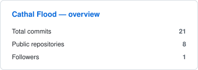
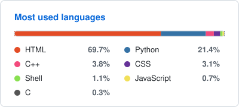

<div align="center">

# CATHAL FLOOD

### Cloud Computing • Infrastructure • DevOps • Networking

[](https://github.com/floodcathal)
[](https://www.linkedin.com/in/cathal-flood/)
[](https://www.tudublin.ie/)

</div>

---

```text
┌─────────────────────────────────────────────────────────────┐
│                                                             │
│  CATHAL FLOOD                                               │
│  Cloud Computing • Infrastructure • DevOps                  │
│                                                             │
│  ┌──────────────────────┐  ┌─────────────────────────────┐  │
│  │ $ whoami             │  │ OS: Windows / Linux         │  │
│  │                      │  │ Cloud: AWS / Azure          │  │
│  │ cathal@cloud         │  │ Languages: Python / C       │  │
│  │                      │  │ DevOps: Docker / Git        │  │
│  │ Cloud Computing      │  │ Monitoring: Grafana         │  │
│  │ Student @ TU Dublin  │  │ Security: OAuth / RBAC      │  │
│  └──────────────────────┘  └─────────────────────────────┘  │
│                                                             │
└─────────────────────────────────────────────────────────────┘
```

## `> About Me`

I'm a **Cloud Computing student at TU Dublin** with a strong interest in infrastructure, DevOps, networking, automation and cloud platforms.

I enjoy building systems that connect **software, infrastructure and monitoring** — from automated cloud workflows to production-style monitoring and authentication systems.

Currently focused on building practical projects with **Python, Docker, Linux, AWS, Azure and modern DevOps tooling**.

---

## `> Tech Stack`

### Cloud & Infrastructure

<p>

</p>

### Development

<p>

</p>

### DevOps / Monitoring

<p>

</p>

**Also:** Node-RED · InfluxDB · Arduino · ESP32 · Cisco Networking · CCNA

---

## `> Featured Project`

### 🎓 QR Attendance & Room Occupancy Platform

A production-style campus attendance and room occupancy monitoring platform developed as my final-year project at TU Dublin.

**Architecture**

```text
QR Code
   │
   ▼
HTTP API
   │
   ▼
Validation / Data Pipeline
   │
   ├──────────────► InfluxDB
   │                    │
   │                    ▼
   │                 Grafana
   │
   └──────────────► Prometheus
                         │
                         ▼
                    Monitoring
```

**Key technologies**

`ESP32` `Python` `Node-RED` `InfluxDB` `Grafana` `Prometheus`
`Docker` `nginx` `Cloudflare` `Microsoft Entra ID` `OAuth 2.0`

**Key features**

- QR-based attendance capture
- Room occupancy monitoring
- Time-series data pipelines
- Grafana dashboards
- Prometheus monitoring
- Microsoft Entra ID SSO
- Role-based access control
- Cloudflare Zero Trust
- Dockerised services
- Input validation and rate limiting

[→ View the project](https://github.com/floodcathal/attendance-project-FYP)

---

## `> What I'm Working On`

```text
[████████████████████░░] Cloud Infrastructure
[██████████████████░░░░] DevOps / CI-CD
[██████████████████░░░░] Python Automation
[████████████████░░░░░░] Networking
[███████████████░░░░░░░] Security
[██████████████░░░░░░░░] Observability
```

- Building and automating cloud infrastructure
- Improving Linux, Docker and networking skills
- Exploring Azure and AWS services
- Developing monitoring and observability systems
- Building projects that demonstrate real infrastructure skills

---

## `> GitHub Stats`

<!-- Rendered by .github/workflows/stats.yml and served from this repo, so they
     cannot break when a shared third-party service runs out of API quota. -->

<div align="center">

<picture>
  <source media="(prefers-color-scheme: dark)" srcset="./stats/overview-dark.svg">
  
</picture>
<picture>
  <source media="(prefers-color-scheme: dark)" srcset="./stats/languages-dark.svg">
  
</picture>

</div>

---

## `> Currently Learning`

```text
Cloud
├── AWS
├── Microsoft Azure
└── Cloud Architecture

DevOps
├── Docker
├── CI/CD
├── GitHub Actions
└── Infrastructure Automation

Observability
├── Prometheus
├── Grafana
└── InfluxDB

Security
├── OAuth 2.0
├── Microsoft Entra ID
├── Cloudflare Zero Trust
└── RBAC
```

---

## `> Certifications & Skills`

| Area | Technologies |
| --- | --- |
| Programming | Python · C · JavaScript · Bash |
| Cloud | AWS · Microsoft Azure |
| Infrastructure | Docker · Linux · nginx · Cloudflare |
| Monitoring | Grafana · Prometheus · InfluxDB |
| Networking | Cisco · CCNA · TCP/IP |
| Web | HTML · CSS · JavaScript |
| Hardware | Arduino · ESP32 |
| DevOps | Git · GitHub · CI/CD · Automation |

---

## `> Let's Connect`

<div align="center">

**Interested in cloud infrastructure, DevOps, networking or automation?**

[](https://github.com/floodcathal)

[](https://www.tudublin.ie/)

</div>

---

<div align="center">

```text
┌──────────────────────────────────────────┐
│                                          │
│   BUILD → BREAK → LEARN → AUTOMATE       │
│                                          │
└──────────────────────────────────────────┘
```

</div>
